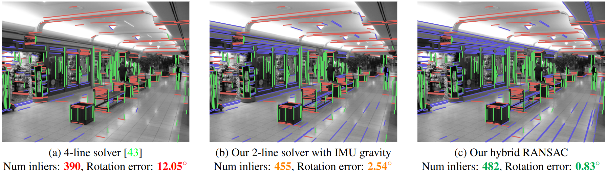

# VP-Estimation-with-Prior-Gravity
Implementation of the paper [Vanishing Point Estimation in Uncalibrated Images with Prior Gravity Direction](https://arxiv.org/abs/2308.10694) (ICCV 2023)



## Installation

### Dependencies

The following dependencies need to be installed on your system:
- GCC >= 9
- CMake >= 3.17
- [Eigen >= 3.4](https://eigen.tuxfamily.org)
- [Ceres](http://ceres-solver.org/)

### Instructions

Clone the repository and its submodules:
```git clone --recurse-submodules https://github.com/cvg/VP-Estimation-with-Prior-Gravity.git```

Install the necessary requirements and the Python package:
```
pip install -r requirements.txt
pip install -Ive .
```


## Demo usage

Check out the [demo notebook](notebooks/demo_vp_estimation_prior_gravity.ipynb) for an example of VP estimation with our hybrid solver.


## Which solver shall I use?

<table style="width:100%" align="center">
  <tr>
    <th align="center">Calibrated images</th>
    <th align="center">Known gravity</th>
    <th align="center">Solver to use</th>
  </tr>
  <tr>
    <td align="center" rowspan="2">Yes</td>
    <td align="center">Yes</td>
    <td align="center">calibrated_100g</td>
  </tr>
  <tr>
    <td align="center">No</td>
    <td align="center">calibrated_210</td>
  </tr>
  <tr>
    <td align="center" rowspan="2">No</td>
    <td align="center">Yes</td>
    <td align="center">hybrid</td>
  </tr>
  <tr>
    <td align="center">No</td>
    <td align="center">uncalibrated_220 or uncalibrated_211</td>
  </tr>
</table>


## Evaluation

Download the test datasets: [YorkUrbanDB](https://www.elderlab.yorku.ca/resources/york-urban-line-segment-database-information/), [ScanNet](http://www.scan-net.org/) (follow the instruction in the [NeurVPS ReadMe](https://github.com/zhou13/neurvps)), and [Lamar](https://lamar.ethz.ch/lamar/) (we use the 4 sequences of the validation query images of the CAB building, located in `CAB/sessions/query_val_hololens`).

Then run one of the scripts `runners/run_york_urban.py`, `runners/run_scannet.py`, or `runners/run_lamar.py`. For example, a typical run on YorkUrban would be:
```
python runnners/run_york_urban.py <name of the solver> <path to the YorkUrban dataset> --nms non_orth --line_detector lsd --use_gt_gravity --magsac_scoring
```

Here are a few explanations on the options:
- `nms`: use 'non_orth' to use our non minimal solver, or 'ceres' to use the same followed by a Ceres refinement (slower).
- `line_detector`: 'lsd' (see https://github.com/iago-suarez/pytlsd) and 'deeplsd' (see https://github.com/cvg/DeepLSD) are currently supported. DeepLSD will probably produce better results but requires a GPU for fast inference.
- `use_gt_gravity`: when using this flag, it will be using the ground truth gravity of the dataset (disabled by default).
- `magsac_scoring`: when using this flag, RANSAC will use the MAGSAC scoring (disabled by default).


## Bibtex
If you use this code in your project, please consider citing the following paper:
```bibtex
@InProceedings{Pautrat_2023_UncalibratedVP,
    author = {Pautrat, Rémi and Liu, Shaohui and Hruby, Petr and Pollefeys, Marc and Barath, Daniel},
    title = {Vanishing Point Estimation in Uncalibrated Images with Prior Gravity Direction},
    booktitle = {International Conference on Computer Vision (ICCV)},
    year = {2023},
}
```
